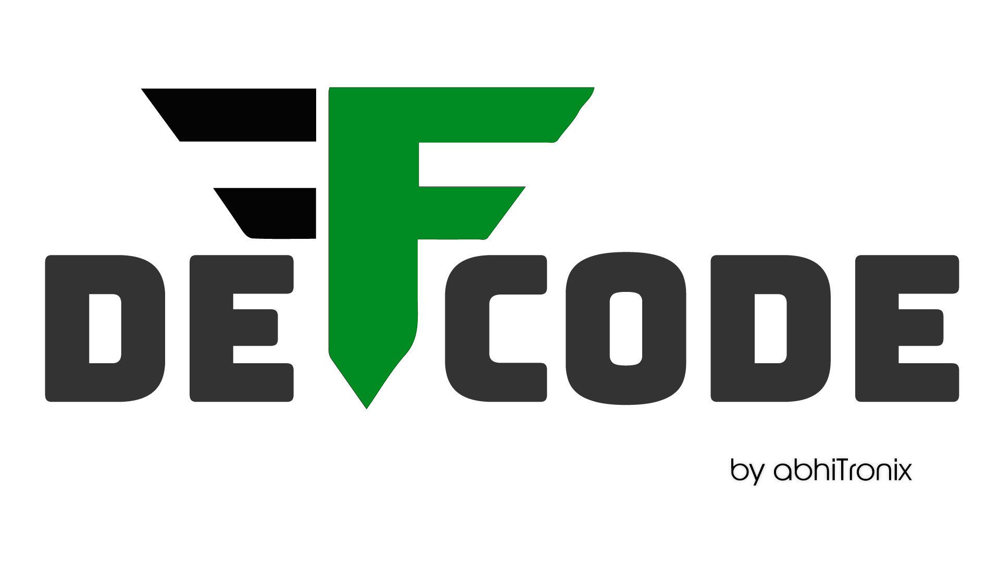

<!--
===============================================
DeFFcode library source-code is deployed under the Apache 2.0 License:

Copyright (c) 2021 Abhishek Thakur(@abhiTronix) <abhi.una12@gmail.com>

Licensed under the Apache License, Version 2.0 (the "License");
you may not use this file except in compliance with the License.
You may obtain a copy of the License at

   http://www.apache.org/licenses/LICENSE-2.0

Unless required by applicable law or agreed to in writing, software
distributed under the License is distributed on an "AS IS" BASIS,
WITHOUT WARRANTIES OR CONDITIONS OF ANY KIND, either express or implied.
See the License for the specific language governing permissions and
limitations under the License.
===============================================
-->

<div align="center">
  
</div>

<div align="center">

[![Build Status][github-cli]][github-flow] [![Codecov branch][codecov]][code]  [![Azure DevOps builds (branch)][azure-badge]][azure-pipeline]

[![Glitter chat][gitter-bagde]][gitter] [![Build Status][appveyor]][app] [![PyPi version][pypi-badge]][pypi] 

[![Code Style][black-badge]][black]

</div>

<div align="center">
  


----

[Releases][release]&nbsp;&nbsp;&nbsp;|&nbsp;&nbsp;&nbsp;[Documentation][docs]&nbsp;&nbsp;&nbsp;|&nbsp;&nbsp;&nbsp;[Installation][install]&nbsp;&nbsp;&nbsp;|&nbsp;&nbsp;&nbsp;[License](#copyright)

----

</div>

&thinsp;


## Overview

> DeFFcode is a powerful High-performance Real-time **Video frames Generator** that wraps FFmpeg pipeline inside a subprocess module for generating blazingly fast video frames in python :fire:

The primary purpose of DeFFcode is to provide a cross-platform solution for fast and low-overhead decoding of a wide range of video streams into 3D [`ndarray`](https://numpy.org/doc/stable/reference/arrays.ndarray.html#the-n-dimensional-array-ndarray) frames while providing **complete control over the underlying FFmpeg pipeline** without the need to go deeper into hefty documentation and in just a few lines of python code.

DeFFcode can **extract frames in real-time with any custom specification imaginable** such as Framerate, Resolution, Hardware decoding, Complex Filters into any pixel format while giving users the complete freedom to play with any desired FFmpeg supported parameter. On top of that, DeFFcode enables **effortless and precise FFmpeg Frame Seeking** natively. 

Finally, DeFFcode APIs are designed with **simplicity, flexibility, and modularity** in mind for the best developer experience. 


&thinsp;

## Key Features

DeFFcode APIs are build on [**FFmpeg**][ffmpeg] - a leading multimedia framework, that gives you the following:

- Extremely exceptional real-time performance :zap: with low-memory footprints.
- Flexible API with access to almost every parameter available within FFmpeg.
- Fast dedicated [Hardware-Accelerated Decoding](https://abhitronix.github.io/deffcode/latest/examples/advanced/#gpu-enabled-hardware-accelerated-decoding).
- Precise FFmpeg [Frame Seeking](https://abhitronix.github.io/deffcode/latest/examples/basic/#saving-keyframes-as-image) with pinpoint accuracy.
- Extensive support for real-time [Complex FFmpeg Filters](https://abhitronix.github.io/deffcode/latest/examples/advanced/#generating-video-with-complex-filter-applied).
- Out-of-the-box support for Computer Vision libraries like OpenCV, Pytorch, etc.
- Support a wide range of media files, devices, image-sequence and network streams.
- Easier to ingest streams into any pixel format that FFmpeg supports.
- Lossless Transcoding support with [WriteGear](https://abhitronix.github.io/deffcode/latest/gears/writegear/introduction/).
- Fewer hard dependencies, and easy to install. 
- Designed modular for best developer experience.
- Cross-platform and runs on Python 3.7+


&nbsp;

## Requirements

- Python 3.7+
- FFmpeg _(See [this doc](https://abhitronix.github.io/deffcode/latest/installation/ffmpeg_install/) for its installation)_


&nbsp;

## Installation

Installation is as simple as:

```sh
$ (sudo) pip install deffcode
```

:bulb: For more details, see [installation notes][install].

&nbsp;


## Getting Started

---

**:books: Documentation: https://abhitronix.github.io/deffcode**

---

The default function of DeFFcode's [FFdecoder API](https://abhitronix.github.io/deffcode/latest/reference/ffdecoder/#ffdecoder-api) is to generate 24-bit RGB (3D [`ndarray`](https://numpy.org/doc/stable/reference/arrays.ndarray.html#the-n-dimensional-array-ndarray)) frames from the given source:

```py title="grab_frames.py"
# import the necessary packages
from deffcode import FFdecoder

# formulate the decoder with suitable source(for e.g. foo.mp4)
decoder = FFdecoder("foo.mp4").formulate()

# grab RGB24(default) 3D frames from decoder
for frame in decoder.generateFrame():
    # lets print its shape
    print(frame.shape)

# print metadata as `json.dump`
print(decoder.metadata)

# terminate the decoder
decoder.terminate()
```

For more examples and in-depth usage guide, kindly refer our **[Basic Recipes :pie:](https://abhitronix.github.io/deffcode/latest/examples/basic)** and **[Advanced Recipes :microscope:](https://abhitronix.github.io/deffcode/latest/examples/advanced)**


:bulb: In case you're run into any problems, consult our [Help](help/get_help) section.


&nbsp;

## Roadmap

- [x] Add clean and elegant documentation.
- [x] Add project Issue and PR templates. 
- [x] Add related unit tests with `pytests`. 
- [ ] Automate stuff with Continuous Integration. **[WIP :construction:]**
- [ ] Add Multiple Source Inputs support.
- [ ] Add Devices and Screen Capture support.
- [ ] Resolve High CPU usage issue with WriteGear API.
- [ ] Add more parameters to Sourcer API's metadata.
- [ ] Implement Buffer and Audio pass-through modes.
- [ ] Add recipe for Source with Multiple Embedded Streams.
- [ ] Add example to dynamically change writable FFdecoder API's metadata parameters. 
- [ ] Add more Advanced Recipes and use cases.
- [ ] Add preliminary benchmarks.
- [ ] Make Frame Seeking dynamic. 

&nbsp;

## Contributions

> Contributions are welcome. We'd love to have your contributions to fix bugs or to implement new features!  

Please see our **[Contribution Guidelines](https://abhitronix.github.io/deffcode/latest/contribution/)** for more details.


&nbsp;

## Community Support

Join our Gitter community channel for quick discussions:

[](https://gitter.im/deffcode-python/community?utm_source=badge&utm_medium=badge&utm_campaign=pr-badge)


&nbsp;

# Donations


> DeFFcode is free and open source and will always remain so. :heart:

It is something I am doing with my own free time. If you would like to say thanks, please feel free to make a donation:

[![ko-fi][kofi-badge]][kofi]


&nbsp;


# Copyright

**Copyright © abhiTronix 2021**

This library is released under the **[Apache 2.0 License][license]**.

<!--
Badges
-->

[appveyor]:https://img.shields.io/appveyor/ci/abhitronix/deffcode.svg?style=for-the-badge&logo=appveyor
[codecov]:https://img.shields.io/codecov/c/gh/abhiTronix/deffcode?logo=codecov&style=for-the-badge&token=zrES4mwVKe
[github-cli]:https://img.shields.io/github/workflow/status/abhiTronix/deffcode/GitHub%20Action%20workflow%20for%20Linux?style=for-the-badge&logo=data:image/svg%2bxml;base64,PHN2ZyB3aWR0aD0iNDgiIGhlaWdodD0iNDgiIGZpbGw9Im5vbmUiIHhtbG5zPSJodHRwOi8vd3d3LnczLm9yZy8yMDAwL3N2ZyI+PHBhdGggY2xpcC1ydWxlPSJldmVub2RkIiBkPSJNMTAgMWE5IDkgMCAwMTkgOSA5IDkgMCAwMS05IDkgOSA5IDAgMDEtOS05IDkgOSAwIDAxOS05ek0yMyAxOWE2IDYgMCAxMTAgMTIgNiA2IDAgMDEwLTEyek0yMyAzNWE2IDYgMCAxMTAgMTIgNiA2IDAgMDEwLTEyeiIgc3Ryb2tlPSJ2YXIoLS1jb2xvci1tYXJrZXRpbmctaWNvbi1wcmltYXJ5LCAjMjA4OEZGKSIgc3Ryb2tlLXdpZHRoPSIyIiBzdHJva2UtbGluZWNhcD0icm91bmQiIHN0cm9rZS1saW5lam9pbj0icm91bmQiLz48cGF0aCBjbGlwLXJ1bGU9ImV2ZW5vZGQiIGQ9Ik00MSAzNWE2IDYgMCAxMTAgMTIgNiA2IDAgMDEwLTEyeiIgc3Ryb2tlPSJ2YXIoLS1jb2xvci1tYXJrZXRpbmctaWNvbi1zZWNvbmRhcnksICM3OUI4RkYpIiBzdHJva2Utd2lkdGg9IjIiIHN0cm9rZS1saW5lY2FwPSJyb3VuZCIgc3Ryb2tlLWxpbmVqb2luPSJyb3VuZCIvPjxwYXRoIGQ9Ik0yNS4wMzcgMjMuNjA3bC0zLjA3IDMuMDY1LTEuNDktMS40ODUiIHN0cm9rZT0idmFyKC0tY29sb3ItbWFya2V0aW5nLWljb24tcHJpbWFyeSwgIzIwODhGRikiIHN0cm9rZS13aWR0aD0iMiIgc3Ryb2tlLWxpbmVjYXA9InJvdW5kIiBzdHJva2UtbGluZWpvaW49InJvdW5kIi8+PHBhdGggY2xpcC1ydWxlPSJldmVub2RkIiBkPSJNNDEgMTlhNiA2IDAgMTEwIDEyIDYgNiAwIDAxMC0xMnoiIHN0cm9rZT0idmFyKC0tY29sb3ItbWFya2V0aW5nLWljb24tcHJpbWFyeSwgIzIwODhGRikiIHN0cm9rZS13aWR0aD0iMiIgc3Ryb2tlLWxpbmVjYXA9InJvdW5kIiBzdHJva2UtbGluZWpvaW49InJvdW5kIi8+PHBhdGggZD0iTTQzLjAzNiAyMy42MDdsLTMuMDY5IDMuMDY1LTEuNDktMS40ODVNNyA2LjgxMmExIDEgMCAwMTEuNTMzLS44NDZsNS4xMTMgMy4yMmExIDEgMCAwMS0uMDA2IDEuNjk3bC01LjExMyAzLjE3QTEgMSAwIDAxNyAxMy4yMDNWNi44MTN6TTkgMTl2MTVjMCAzLjg2NiAzLjE3NyA3IDcgN2gxIiBzdHJva2U9InZhcigtLWNvbG9yLW1hcmtldGluZy1pY29uLXByaW1hcnksICMyMDg4RkYpIiBzdHJva2Utd2lkdGg9IjIiIHN0cm9rZS1saW5lY2FwPSJyb3VuZCIgc3Ryb2tlLWxpbmVqb2luPSJyb3VuZCIvPjxwYXRoIGQ9Ik0xNi45NDkgMjZhMSAxIDAgMTAwLTJ2MnpNOCAxOS4wMzVBNi45NjUgNi45NjUgMCAwMDE0Ljk2NSAyNnYtMkE0Ljk2NSA0Ljk2NSAwIDAxMTAgMTkuMDM1SDh6TTE0Ljk2NSAyNmgxLjk4NHYtMmgtMS45ODR2MnoiIGZpbGw9InZhcigtLWNvbG9yLW1hcmtldGluZy1pY29uLXByaW1hcnksICMyMDg4RkYpIi8+PHBhdGggZD0iTTI5LjA1NSAyNWg1Ljk0NCIgc3Ryb2tlPSJ2YXIoLS1jb2xvci1tYXJrZXRpbmctaWNvbi1wcmltYXJ5LCAjMjA4OEZGKSIgc3Ryb2tlLXdpZHRoPSIyIiBzdHJva2UtbGluZWNhcD0icm91bmQiIHN0cm9rZS1saW5lam9pbj0icm91bmQiLz48cGF0aCBmaWxsLXJ1bGU9ImV2ZW5vZGQiIGNsaXAtcnVsZT0iZXZlbm9kZCIgZD0iTTIxIDQwYTEgMSAwIDExLS4wMDEgMi4wMDFBMSAxIDAgMDEyMSA0MHpNMjUgNDBhMSAxIDAgMTEtLjAwMSAyLjAwMUExIDEgMCAwMTI1IDQweiIgZmlsbD0idmFyKC0tY29sb3ItbWFya2V0aW5nLWljb24tc2Vjb25kYXJ5LCAjNzlCOEZGKSIvPjxwYXRoIGQ9Ik0zNC4wMDUgNDEuMDA3bC0xLjAxMy4wMzMiIHN0cm9rZT0idmFyKC0tY29sb3ItbWFya2V0aW5nLWljb24tc2Vjb25kYXJ5LCAjNzlCOEZGKSIgc3Ryb2tlLXdpZHRoPSIyIiBzdHJva2UtbGluZWNhcD0icm91bmQiLz48L3N2Zz4=
[prs-badge]:https://img.shields.io/badge/PRs-welcome-brightgreen.svg?style=for-the-badge&logo=data:image/png;base64,iVBORw0KGgoAAAANSUhEUgAAACAAAAAgCAYAAABzenr0AAABC0lEQVRYhdWVPQoCMRCFX6HY2ghaiZUXsLW0EDyBrbWtN/EUHsHTWFnYyCL4gxibVZZlZzKTnWz0QZpk5r0vIdkF/kBPAMOKeddE+CQPKoc5Yt5cTjBMdQSwDQToWgBJAn3jmhqgltapAV6E6b5U17MGGAUaUj07TficMfIBZDV6vxowBm1BP9WbSQE4o5h9IjPJmy73TEPDDxVmoZdQrQ5jRhly9Q8tgMUXkIIWn0oG4GYQfAXQzz1PGoCiQndM7b4RgJay/h7zBLT3hASgoKjamQJMreKf0gfuAGyYtXEIAKcL/Dss15iq6ohXghozLYiAMxPuACwtIT4yeQUxAaLrZwAoqGRKGk7qDSYTfYQ8LuYnAAAAAElFTkSuQmCC
[azure-badge]:https://img.shields.io/azure-devops/build/abhiuna12/942b3b13-d745-49e9-8d7d-b3918ff43ac2/3/master?logo=azure-pipelines&style=for-the-badge
[pypi-badge]:https://img.shields.io/pypi/v/deffcode.svg?style=for-the-badge&logo=pypi
[gitter-bagde]:https://img.shields.io/badge/Chat-Gitter-blueviolet.svg?style=for-the-badge&logo=gitter
[Coffee-badge]:https://abhitronix.github.io/img/deffcode/orange_img.png
[kofi-badge]:https://www.ko-fi.com/img/githubbutton_sm.svg
[black-badge]:https://img.shields.io/badge/code%20style-black-000000.svg?style=for-the-badge&logo=github


<!--
Internal URLs
-->
[docs]:https://abhitronix.github.io/deffcode/latest/
[install]:https://abhitronix.github.io/deffcode/latest/installation/
[release]:https://github.com/abhiTronix/deffcode/releases/latest
[license]:https://github.com/abhiTronix/deffcode/blob/master/LICENSE
[github-flow]:https://github.com/abhiTronix/deffcode/actions/workflows/CIlinux.yml
[azure-pipeline]:https://dev.azure.com/abhiuna12/public/_build?definitionId=3
[app]:https://ci.appveyor.com/project/abhiTronix/deffcode
[code]:https://codecov.io/gh/abhiTronix/deffcode
[black]: https://github.com/psf/black

<!--
External URLs
-->

[ffmpeg]:https://www.ffmpeg.org/
[pypi]:https://pypi.org/project/deffcode/
[gitter]:https://gitter.im/deffcode-python/community?utm_source=badge&utm_medium=badge&utm_campaign=pr-badge
[coffee]:https://www.buymeacoffee.com/2twOXFvlA
[kofi]: https://ko-fi.com/W7W8WTYO
